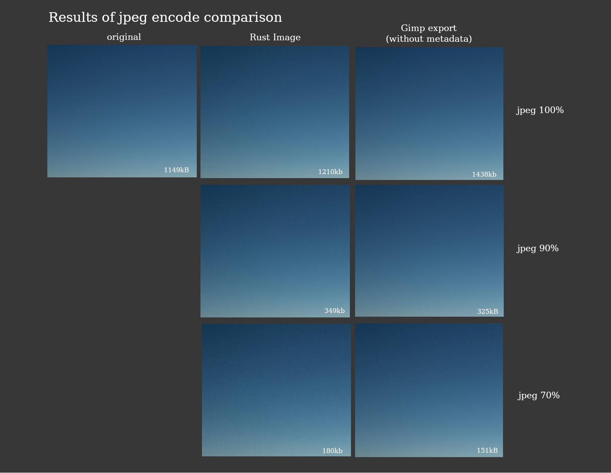
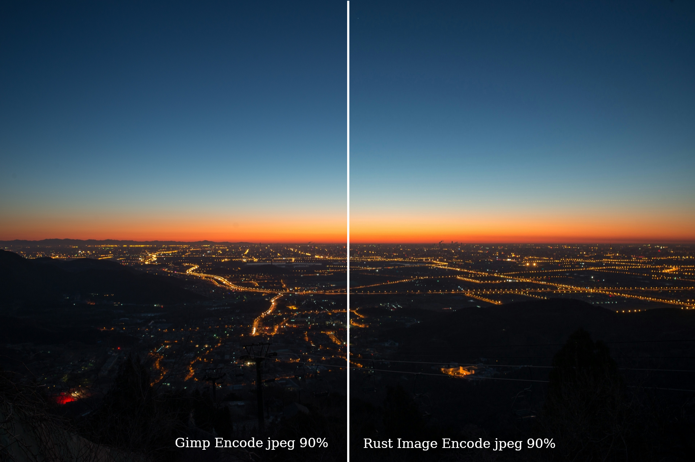

This tries to reproduce an issue reported at https://zola.discourse.group/t/jpeg-image-quality/1227

The folder `in` contains three different images, downloaded from unsplash.com in full resolution (4K+),
then scaled down to `1920x1280` and saved as `jpeg` with `100%` quality in Krita.
These are the input images for the test.

The folder `out` contains these same images, "resized" to exactly the same size with the `image` crate.
For each of the three images 10 versions (`10%`-`100%` in steps of `10`) are generated programmatically.

The folder `ref` contains the same three images from `in`, just opened with Krita, and then resaved
as-is with 100% quality. (When doing `ls -al` on the `in` and the `ref` folder one sees that the images
each have significantly diverging sizes between the input and the re-saved versions, indicating that Krita
is indeed performing a re-encode (and not simply saving a verbatim copy).

See `src/main.rs` for the minimal source code used to generate the images. 

## Results

Focusing on areas with similar colors, like skies:

- With quality at 100%, the "image" encoder introduces bending and a green tint, compared to no bending and not tint in Gimp with similar settings.
- With quality at 90%, the "image" encoder produced an expected filesize while quality is significantly worse than the Gimp version, which is still nearly visually lossless
- With quality at 70%, quality starts to become compareable to the gimp version, while a slightly greenish tint remains.

There was no difference in quality whether the resize function was used or not.
There was no visible difference in quality in more complex high-frequency parts of the image.

